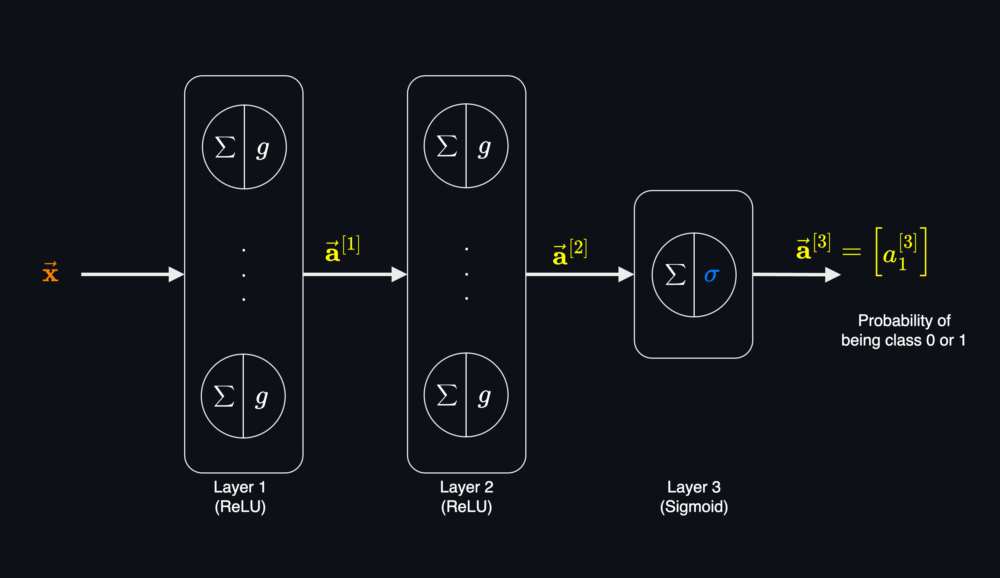
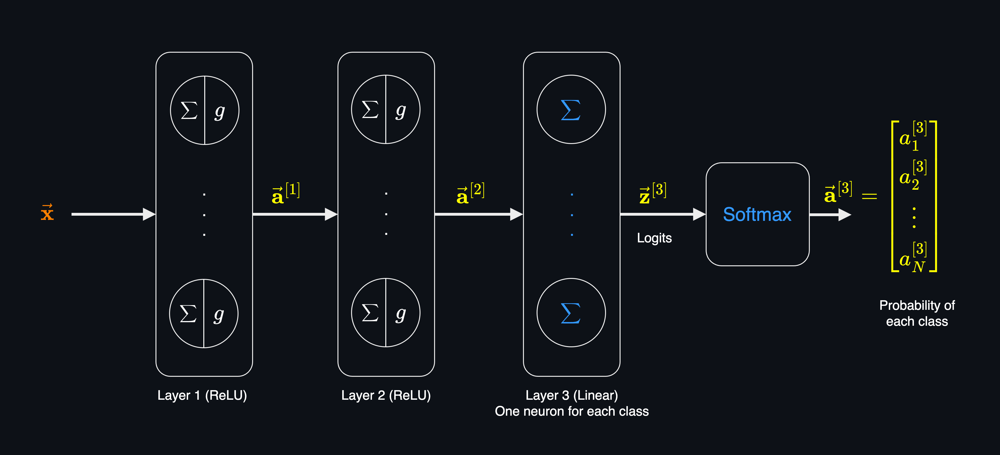

# Multiclass Classification
Multiclass classification is a classification task that the target variable can take on more than two values. In other words, the target variable $y$ can take on $N$ different classes, where $N > 2$.

Some of the examples of multiclass classification problems include:

| Question | Target Variable | Classes |
| --- | --- | --- |
| What type of tumor is this? | Malignant, Benign, Normal | $N=3$ |
| Hand written digit recognition | 0, 1, 2, 3, 4, 5, 6, 7, 8, 9 | $N=10$ |
| What type of animal is this? | Cat, Dog, Bird | $N=3$ |
| What type of vehicle is this? | Car, Truck, Bus, Motorcycle, Bicycle | $N=5$ |
| Next word (English) prediction in NLP | [Vocabulary of words/tokens](https://arxiv.org/abs/2406.16508) | $N=50,000+$ |

In binary classification, the target variable $y$ can take only two values, 0 or 1. That's why an algorithm like logistic regression which uses the sigmoid function is an appropriate choice for binary classification.

However, for multiclass classification, where $y$ can take on multiple values, we need a different algorithm such as **Softmax Regression** which is the generalization of logistic regression algorithm.

## Binary Classification
Let's start with the binary classification and then move on to the multiclass classification.

**In Binary Classification:** 
The model output a single value between 0 and 1, which is the probability of the target variable being 1.

In the output layer:

Logits: 

$$z^{[3]}_1 =  \vec{\mathbf{w}}^{[3]}.\vec{\mathbf{a}}^{[2]} + b^{[3]}$$

Activation function(Sigmoid): 
$$a^{[3]}_1 = \sigma(z^{[3]}_1) = \frac{1}{1 + e^{-z^{[3]}_1}}$$

The output of the model is the probability of the target variable $y$ being 1.

$$P(y=1|\vec{\mathbf{x}};\vec{\mathbf{w}},b) = a^{[3]}_1$$

The total probability of the target variable being 1 or 0 should be 1, so:

$$P(y=1|\vec{\mathbf{x}};\vec{\mathbf{w}},b) + P(y=0|\vec{\mathbf{x}};\vec{\mathbf{w}},b) = 1$$

So the probability of the target variable being 0 is:

$$P(y=0|\vec{\mathbf{x}};\vec{\mathbf{w}},b) = 1 - a^{[3]}_1$$

## Multiclass Classification

The output layer of multiclass classification is different from binary classification. The last layer first calculates the logits for each class, and then pass all the logits $\vec{\mathbf{z}}$ to the softmax function to get the probabilities of each class.

The final output of the model (after softmax) is a vector of $N$ values ($N$ is the number of classes) where each value is the probability of the target variable being that class.

Notes:
- The last layer doesn't have an activation function, or in other words have [Linear Activation Function](neural_networks_activation_functions.md#linear-activation-function). So, it only calculates the logits.
- The last layer has $N$ neurons, where $N$ is the number of classes in the target variable.
- Output of Softmax function is a vector of with the same size as the input vector (number of classes). Softmax function normalizes the input vector into a probability distribution.

In the output layer:

Logits: 
$$z^{[3]}_1 =  \vec{\mathbf{w}}^{[3]}.\vec{\mathbf{a}}^{[2]} + b^{[3]}$$

Activation function (Softmax): 

$$\vec{\mathbf{a}}^{[3]} = softmax(\vec{\mathbf{z}}^{[3]})$$

### Softmax
Softmax regression is a generalization of logistic regression to the case where we want to handle multiple classes. In softmax regression, the output of the model is a vector of $N$ values, where $N$ is the number of classes. Each value is the probability of the target variable being that class.

Softmax function is used to convert the logits into probabilities. The softmax function takes a vector of $N$ real numbers and normalizes it into a probability distribution consisting of $N$ probabilities.

Given a vector of logits $\vec{\mathbf{z}}$:
$$\vec{\mathbf{z}} = [z_1, z_2, ..., z_N]$$

The softmax function is defined as:

$$a_i = \frac{e^{z_i}}{\sum_{j=1}^{N} e^{z_j}}$$

Where:
- $a_i$ is the probability of the target variable being class $i$.
- $z_i$ is the logit of class $i$.

If we expand that for each class, we get:

$$a_1 = \frac{e^{z_1}}{e^{z_1} + e^{z_2} + ... + e^{z_N}} = P(y=1|x;\vec{\mathbf{w}},b)$$
$$\vdots$$
$$a_N = \frac{e^{z_N}}{e^{z_1} + e^{z_2} + ... + e^{z_N}}= P(y=N|x;\vec{\mathbf{w}},b)$$

In the above example, where we had 3 layers, if we have 3 classes (N=3), in the last layer of the model:

**For class 1:** 
Logit: 
$$z^{[3]}_1 =  \vec{\mathbf{w}}^{[3]}.\vec{\mathbf{a}}^{[2]} + b^{[3]}$$

Softmax: 
$$a^{[3]}_1 = \frac{e^{z^{[3]}_1}}{e^{z^{[3]}_1} + e^{z^{[3]}_2} + e^{z^{[3]}_3}}$$

**For class 2:** 
Logit: 
$$z^{[3]}_2 =  \vec{\mathbf{w}}^{[3]}.\vec{\mathbf{a}}^{[2]} + b^{[3]}$$

Softmax: 
$$a^{[3]}_2 = \frac{e^{z^{[3]}_2}}{e^{z^{[3]}_1} + e^{z^{[3]}_2} + e^{z^{[3]}_3}}$$

**For class 3:** 
Logit: 
$$z^{[3]}_3 =  \vec{\mathbf{w}}^{[3]}.\vec{\mathbf{a}}^{[2]} + b^{[3]}$$
Softmax: 
$$a^{[3]}_3 = \frac{e^{z^{[3]}_3}}{e^{z^{[3]}_1} + e^{z^{[3]}_2} + e^{z^{[3]}_3}}$$

So, the output of the model is a vector of $N$ values, where each value is the probability of the target variable being that class.

$$\vec{\mathbf{a}}^{[3]} = g(\vec{\mathbf{z}}^{[3]})$$

Where:
- $g$ is the softmax function.
- $\vec{\mathbf{z}}^{[3]}$ is the vector of logits of the output layer.

> The key difference between the softmax function and other activation functions is that they are the activation function of the logit of a **single** neuron (element-wise operation), whereas the softmax function is function of **all** neurons, and applied to the logits of **all** the neurons in the output layer.

Each value in the output vector is the probability of the target variable being that class. The total probability of all classes should be 1:

Probability of class 1: 
$$P(y=1|\vec{\mathbf{x}};\vec{\mathbf{w}},b) = a^{[3]}_1$$
Probability of class 2: 
$$P(y=2|\vec{\mathbf{x}};\vec{\mathbf{w}},b) = a^{[3]}_2$$
$$...$$
Probability of class N: 
$$P(y=N|\vec{\mathbf{x}};\vec{\mathbf{w}},b) = a^{[3]}_N$$

Total probability of all classes should be 1.
$$a^{(1)}_1 + a^{(1)}_2 + ... + a^{(1)}_N = 1$$

Which can be written as:
$$P(y=1|x;\vec{\mathbf{w}},b) + P(y=2|x;\vec{\mathbf{w}},b) + ... + P(y=N|x;\vec{\mathbf{w}},b) = 1$$

And can be summarized as:
$$\sum_{i=1}^{N} P(y=i|x;\vec{\mathbf{w}},b) = 1$$

For example if $N=3$ and we have the following probabilities:
$$\vec{\mathbf{a}}^{[3]} = [0.12, 0.23, 0.65]$$

Then we interpret it as:

Total probability of all classes:
$$0.12 + 0.23 + 0.65 = 1$$

Probability of class 1: 12% 
Probability of class 2: 23% 
Probability of class 3: 65% 

It means there is 12% chance that the predicted output is class 1, 23% chance that it's class 2, and 65% chance it's class 3.

## Loss Function
The loss function for multiclass classification is the [Cross-Entropy Loss](loss_and_cost_functions.md#cross-entropy-loss) function. The cross-entropy loss function is used to measure the difference between the predicted probability distribution and the true probability distribution.

Softmax output is a vector of probabilities for each class. The following is a specific case of the cross-entropy loss function for multiclass classification where the classes are defined as integers from 1 to N. This is called the **Sparse Categorical Cross-Entropy** loss function.

$$
\begin{aligned}
  L(\mathbf{\vec{a}},y)=\begin{cases}
    -log(a_1), & \text{if $y=1$}\\
    -log(a_2), & \text{if $y=2$}\\
        &\vdots\\
     -log(a_N), & \text{if $y=N$}
  \end{cases}
\end{aligned}
$$
where:
- $N$ is the number of classes.
- $y$ is the true class label for the instance.
- $\mathbf{\vec{a}}$ is the predicted probability vector for the instance. $\vec{\mathbf{a}} = [a_1, a_2, ..., a_{N}]$, where $a_i$ is the predicted probability of class $j_{th}$.1

More on the Cross-Entropy Loss, Negative Log-Likelihood and Sparse Categorical Cross-Entropy [here](loss_and_cost_functions.md#cross-entropy-loss).
